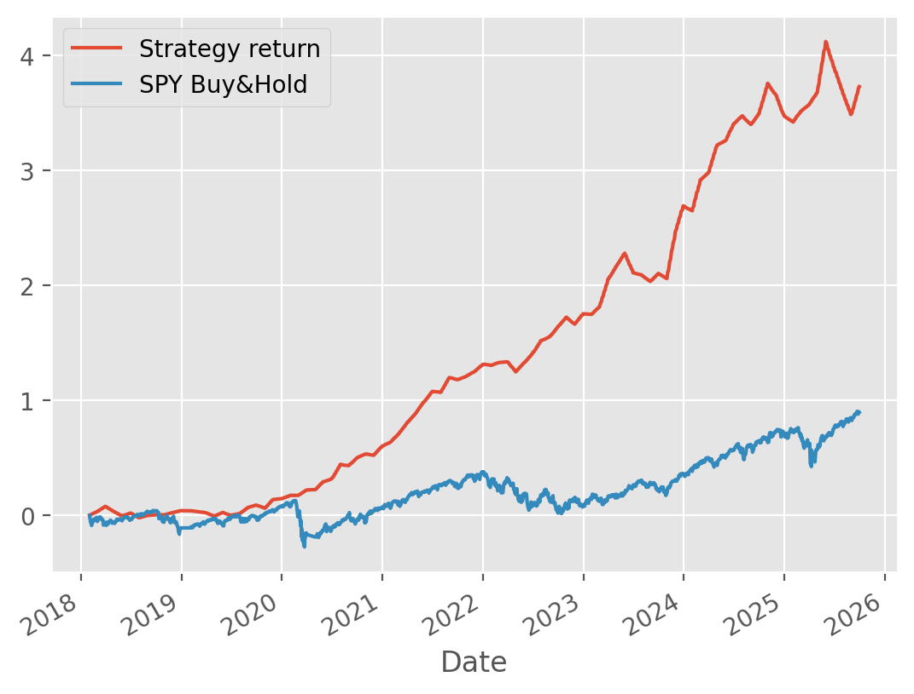

<p align="center">

  <!-- Python -->
  

  <!-- Pandas -->
  

  <!-- NumPy -->
  

  <!-- scikit-learn -->
  

  <!-- Statsmodels -->
  

  <!-- PyPortfolioOpt -->
  

  <!-- Matplotlib -->
  

  <!-- yFinance -->
  

</p>


# 📈 Unsupervised Trading Strategy on the S&P 500  
### *Clustering + Factor Modeling + Portfolio Optimization (10-Year Backtest)*  

This project builds a fully systematic **quantitative trading strategy** using an **unsupervised machine learning pipeline** on 10 years of S&P 500 data.  
It combines **feature engineering**, **K-Means clustering**, **Fama–French factor modeling**, and **maximum Sharpe ratio portfolio optimization** to create a robust, data-driven equity selection and allocation framework.

The goal is to demonstrate end-to-end quant research skills:  
**data acquisition → alpha signal generation → ML clustering → factor modeling → portfolio construction → backtesting → benchmarking.**

---

## 🚀 Project Highlights  
- 10 years of S&P 500 data automatically fetched from Yahoo Finance  
- Full suite of technical indicators (RSI, ATR, MACD, Bollinger Bands, GK volatility)  
- Liquidity filtering and multi-horizon return engineering  
- K-Means clustering with custom centroid initialization  
- Rolling Fama–French 5-factor betas integrated as features  
- Maximum Sharpe ratio portfolio optimization via PyPortfolioOpt  
- Monthly backtest vs SPY benchmark  
- Clean visualizations and interpretable clusters  

---

## 📊 Final Strategy vs S&P 500 Performance  

Below is the main output of the project showcasing the  
**cumulative return of the strategy vs SPY**:

> *(Replace this with your final figure)*  
>
> 

---

## 🧠 Skills Demonstrated  

### Quantitative Finance  
- Factor modeling (Fama–French)  
- Efficient Frontier & max-Sharpe optimization  
- Multi-horizon return engineering  
- Liquidity-constrained universe selection  

### Machine Learning  
- K-Means clustering  
- Custom centroid initialization  
- Time-series ML feature design  

### Data Engineering  
- Automated data ingestion  
- MultiIndex financial structures  
- Vectorized pandas pipelines  
- Clean, modular notebooks  

---

## ▶️ How to Run  
```bash
git clone https://github.com/saeedmohseni97/sp500-kmeans-portfolio-optimization.git
Unsupervised Trading Strategy notebook
```

---

## 👨‍💻 Author
**Saeed Mohseni**  
Graduate Researcher, Institute for Advanced Computing  
Virginia Tech, VA, USA  

🌐 [Website](https://saeedmohseni.netlify.app/) | 📫 saeedmohseni@vt.edu  

---

## 🌟 If you like this project...
⭐ **Star** the repository  
🍴 **Fork** it  
🧠 **Discuss** ideas or improvements  
