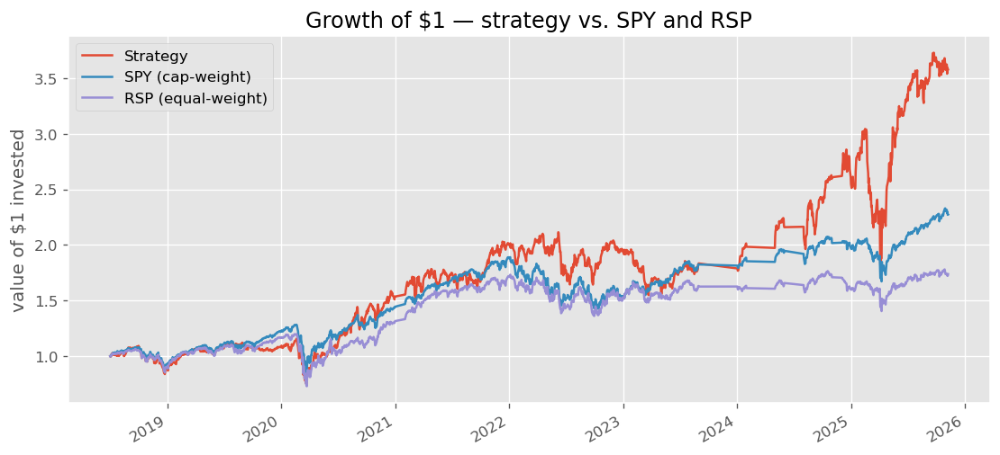

<p align="center">
  
  
  
  
  
  
  
</p>

# Unsupervised Trading Strategy on the S&P 500

An end-to-end systematic equity strategy: cluster the S&P 500 each month with K-means, follow the highest-momentum cluster into the next month, size the book with a max-Sharpe optimizer net of trading costs, and measure it against both the cap-weighted (SPY) and equal-weighted (RSP) index.

The emphasis is on doing the backtest *honestly* — realistic costs and a fair benchmark — rather than chasing a headline number.

---

## Results (2018–2025, net of 10 bps turnover cost)



| Metric | **Strategy** | SPY (cap-weight) | RSP (equal-weight) |
|---|---:|---:|---:|
| CAGR | **32.0%** | 15.6% | 13.9% |
| Sharpe | **1.07** | 0.87 | 0.79 |
| Sortino | 1.42 | 1.15 | 1.08 |
| Volatility | 30.1% | 18.6% | 18.7% |
| Max drawdown | −33.4% | −24.5% | −21.4% |
| Annualized alpha vs. SPY | **+14.3%** | — | — |
| Beta vs. SPY | 1.11 | — | — |

The strategy beats both benchmarks on a risk-adjusted basis (higher Sharpe than cap- and equal-weight), but it does so as a **higher-risk, more concentrated book** — roughly 1.6× the index volatility and a deeper drawdown. Across the backtest, 76 of 95 monthly rebalances solved the max-Sharpe optimization; the remaining ~24% fell back to equal weight.

---

## How it works

1. **Universe & prices.** Current S&P 500 membership from Wikipedia (parsed by matching the *Symbol* column, not a fixed table index), then ten years of daily bars from Yahoo Finance.
2. **Features.** Per-stock technical signals — Garman–Klass volatility, RSI, Bollinger bands, standardized ATR and MACD — plus dollar volume for the liquidity screen.
3. **Monthly panel.** Daily data collapsed to month-end via a grouped resample (last value for signals, mean for dollar volume).
4. **Liquidity screen.** Keep the 150 most-traded names each month, ranked on a 12-month average of dollar volume so the set doesn't churn.
5. **Momentum.** Multi-horizon trailing returns plus the classic **12-minus-1** momentum used for selection, skipping the most recent month avoids short-term reversal.
6. **Factor exposure.** Rolling betas to the Fama–French five factors, lagged one month to stay point-in-time.
7. **Clustering.** Each month's cross-section is **standardized** (so no feature dominates on scale alone) and split into four groups with K-means; the cluster with the strongest 12-1 momentum is selected to hold next month.
8. **Portfolio.** Max-Sharpe optimization on the trailing year, capped at 10% per name, with an equal-weight fallback when infeasible. A **10 bps cost is charged on turnover** at each rebalance.
9. **Evaluation.** Backtested against SPY and RSP, with a full metrics table (return, volatility, Sharpe, drawdown, CAPM alpha/beta) and a cumulative growth chart.

---

## Running it

```bash
pip install yfinance pandas-datareader statsmodels scikit-learn PyPortfolioOpt matplotlib lxml requests pandas numpy
```

Open `Unsupervised_Trading_Strategy.ipynb` and run **Kernel → Restart & Run All**.

Every download (constituents, prices, Fama–French factors, SPY, RSP) is cached to a local `data_cache/` folder on the first run, so subsequent runs read from disk and work offline. Delete `data_cache/` for a clean refetch.

---

## Tech stack

Python · pandas · NumPy · scikit-learn · statsmodels · PyPortfolioOpt · yfinance · pandas-datareader · Matplotlib

---

## 👨‍💻 Author
**Saeed Mohseni seh deh**  
Graduate Researcher, Institute for Advanced Computing  
Virginia Tech, VA, USA  

🌐 [Website](https://saeedmohseni.netlify.app/) | 📫 [saeedmohseni@vt.edu](mailto:saeedmohseni@vt.edu)

---

## 🌟 If you like this project...
⭐ **Star** the repository  
🍴 **Fork** it  
🧠 **Discuss** ideas or improvements
